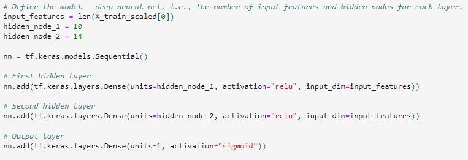
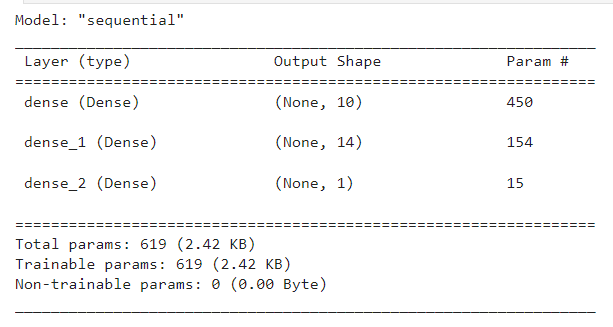
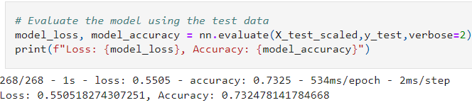
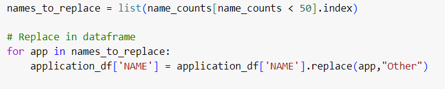
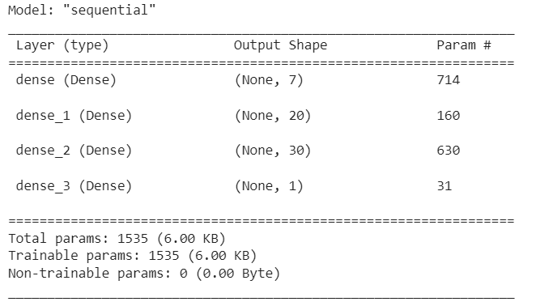
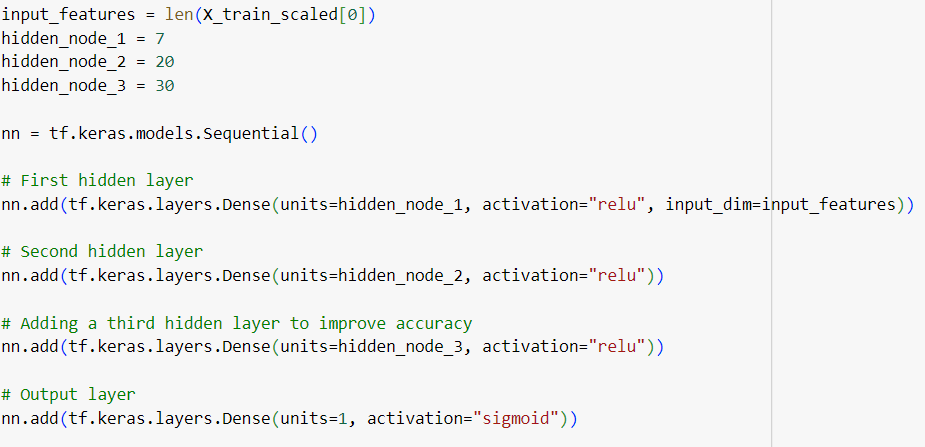
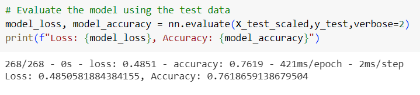

# Neural Network Model Report

## Overview
The purpose of this analysis was to create a binary classifier model that can predict whether applicants' ventures will be successful if funded by the nonprofit organization Alphabet Soup. Alphabet Soup’s business team, provided a CSV containing more than 34,000 organizations that have received funding over the years. Using knowledge on neural networks, a model with at least 75% accuracy was created using scikit-learn, Pandas, and TensorFlow.

## Results

## Data Preprocessing

* The target for the model was the "IS SUCCESSFUL" column. This helps predict whether an applicant will be successful after funding. 
* The features for the model were the "application_types_to_replace", "classifications_to_replace", and "name_to_replace" variables.
* The variable that was removed from the input data was the "EIN" variable. That was not beneficial to the analysis. 

## Compiling, Training, and Evaluating the Model

For my first model there were 2 hidden layers. I used the following activation functions:  

  

  

I noticed that the total number of trainable params was 619 so I thought to increase the number of params in my final model. This would hopefully increase the accuracy of the model.  

  

I was able to achieve an accuracy of 73% for my first model which was close to the ultimate goal of 75% accuracy.  

## Model Optimization

For the next model, I decided to keep the "NAME" column. I filtered out "NAME" where the value counts were less than 50. Creating more bins could increase the number of rare occurances in the "NAME" column. 

  

The total number of trainable params was increased to 1535 and I increased the number of epochs to 150.

  
 

I also added a third hidden layer. The following activation functions were used:

  

  

Increasing the number of columns that were analyzed, the number of hidden layers, and the number of epochs helped raise the model's accuracy. The optimized model achieved an accuracy of 76%.

## Summary

It took some trial and error until my model achieved an accuracy of at least 75%. Adding more bins, hidden layers, epochs increased the accuracy. A more accurate model would be more desireable especially in industries like pharmacuticals and banking where there is less room for error.

Another way to solve this classificatin problem would be to use ensemble learning. You can combine multiple models (like Random Forest) to improve predicitive performance. This works by aggregating predicitons which would improve accuracy and decrease overfitting. 